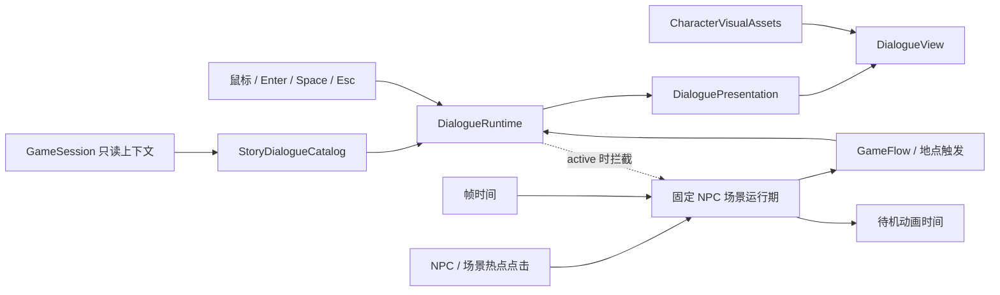

# 人物小人与轻量对话系统规划

## 目的与阶段定位

本文定义 P4 人物小人、统一对话框和主角/NPC 对话的实施边界。当前先用稳定的占位视觉规格跑通共享基础和各场景垂直切片；基础功能、输入、字体和截图验收稳定后，再由 Issue 17 统一替换最终 imagegen/人工处理资产。

该功能承接 `docs/story/LOCATIONS_AND_NPCS.md` 的镇长、餐馆老板、便利店店主、图书馆管理员、酒保和主角自我独白，但不把项目扩展为对话树、好感度、恋爱、任务链或开放世界 NPC 系统。

2026-07-14 架构收敛：项目取消主角室内移动、NPC 巡逻、寻路和运行时碰撞。所有 NPC 固定在柜台或作者指定热点循环待机动画，玩家通过点击人物或场景热点进入共享对话和既有玩法。酒馆继续使用现有六帧酒保待机图；图书馆使用固定管理员动画槽和程序 fallback，最终 sprite 仍由 Issue 17 人工批准。

## 已确认决定

- 对话采用短小线性脚本，不提供分支选项。
- 人物和对话只负责展示与输入，不直接修改金钱、属性、天数、库存、酒馆战绩或结局。
- 对话打开时是模态层，必须优先消费输入并冻结地点计时；关闭后恢复原流程。
- 第一版不保存对话行进度或已读标记；从阶段边界恢复时允许重播无奖励对话。
- 第一版不新增地点访问次数、好感度或 NPC 进度，不改变 v1 存档格式。
- 若后续必须实现“一生只出现一次”或按访问次数变化的熟悉对话，需单独评估 v2 存档迁移，不在本批次顺手加入。
- 最终剧情回收继续使用现有每日总结、评议会和结局入口，不新增 `GamePhase`。
- 小镇地图和所有室内场景都使用静态热点，不提供主角移动控制。
- NPC 固定在柜台或作者指定位置，循环播放待机动画；鼠标点击是主要互动方式，Space 可作为当前固定 NPC 的等价入口。
- 不实现 NPC 路点、巡逻、A*、动态避障或角色碰撞；静态碰撞数据只可用于 F3 美术对齐诊断，不参与玩法。
- 餐馆、便利店、图书馆和家从地图进入后先显示场景大厅；大厅 NPC 热点可以先使用程序占位，但在正式对话接入前只显示预留提示，不修改行动阶段或玩家状态。点击主要活动后再进入原有玩法/休息确认。
- NPC 热点和待机动画时间不保存，不新增跨日位置或已读进度。

## 首版角色与触发矩阵

| 触发点 | 对话角色 | 首版目标 | 对流程的影响 |
| --- | --- | --- | --- |
| 新游戏确认后 | 镇长、主角 | 地图、钥匙和十日约定，3-4 句 | 对话结束后进入第一日地图 |
| 餐馆大厅 NPC 热点 | 餐馆老板、主角 | 围裙、订单和服务节奏，2-3 句 | 对话关闭后才进入餐馆工作准备；倒计时不提前启动 |
| 便利店大厅 NPC 热点 | 便利店店主、主角 | 天气、库存和账本，2-3 句 | 对话关闭后才进入进货、定价和销售流程 |
| 图书馆固定管理员热点 | 管理员、主角 | 分类、借书卡和旧地图，2-3 句 | 点击管理员完成短对话后进入读者咨询/书籍整理选择 |
| 酒馆固定酒保热点 | 酒保、主角 | 桌游、赌注和夜晚规矩，2-3 句 | 点击酒保进入共享对话，桌面热点进入既有挑战 |
| 家中大厅热点/准备休息 | 主角独白或访客 | 热水、日记和明天，1-2 句 | 大厅互动不消耗阶段；确认休息后才应用既有收益与总结 |
| 第十日收束 | 镇长与地点回声 | 继续由评议会和唯一主结局收束 | 不新增可持久化阶段 |

每句正文以 32-36 个中文字符为建议上限；一个对话框最多显示三行，超长文本必须分页或压缩，不能越出 960×540 逻辑画布。

## 占位人物视觉规格

首轮开发锁定接口和槽位，不锁定最终人物造型：

| 项目 | 首轮规格 |
| --- | --- |
| 原生人物帧 | 32×32 px，透明背景，最近邻采样 |
| 待机动画 | 可选 4 帧横排，128×32 px；没有动画时允许单帧 |
| 待机状态 | NPC 始终朝向交互视角；不制作四方向移动、转向或巡逻帧 |
| 场景显示 | 原生 1× 或 2× 整数倍，不做平滑缩放和任意旋转 |
| 对话人物槽 | 复用人物帧按 2× 显示，槽位约 72×72 设计单位 |
| 对话框 | 640×360 设计网格底部约 `48,226,544,116`，映射到 960×540 逻辑画布 |
| 文本 | 角色名、正文、行进度和继续/跳过按钮全部由程序字体绘制 |
| 失败回退 | 图片缺失时使用程序绘制的人物轮廓与姓名，不阻断规则测试 |

建议运行时命名为 `<character>_idle_<frames>f.png`，例如 `mayor_idle_4f.png`。现有 64×64 六帧酒保素材作为候选兼容输入，由视觉注册表适配；Issue 17 再决定重采样、重新生成或替换。

imagegen 适合生成统一人物设定稿和透明/色键候选小人，但最终 sprite 需要在原生尺寸人工检查轮廓、帧对齐和透明边缘。进入发布包的生成资产必须保留原始图、处理图、用途、hash 和人工验收记录。

## 推荐架构

### 剧情目录

raylib-free 的剧情目录拥有角色标识、触发标识、说话人和线性台词。它可以读取天数、地点和既有只读属性选择已确认脚本，但不拥有 UI 状态，也不修改游戏会话。

首版文本量有限，优先使用小而明确的 C++ 数据结构，并从目录本身汇总字体字形。暂不引入 JSON、通用内容编辑器或新的外部依赖；只有文本规模显著增长后再评估简单数据文件。

### 对话运行期

`DialogueRuntime` 采用与 `TavernRuntime` 相似的窄接口：打开脚本、接收显式帧输入、返回只读 presentation、查询是否 active。运行期只保存当前脚本和行号；继续、跳过和关闭不会应用行动结果。

对话 active 时，应用必须先更新对话并立即返回，不能继续更新餐馆倒计时、便利店输入、图书馆答题或酒馆挑战。对话关闭后由原场景继续。

### 对话展示与人物资源

展示层只读取 presentation 和当前可用的人物视觉资源，统一绘制背景遮罩、人物槽、姓名、正文、页码和按钮。基础切片可使用共享程序 fallback；文字使用共享 UTF-8 限行布局，禁止重新复制按字节遍历中文的换行实现。

现有酒保素材继续由 `TavernVisualAssets` 管理；餐馆老板等尚无批准纹理的角色使用共享程序 fallback。等 Issue 17 接入多套最终人物纹理时，再集中为 `CharacterVisualAssets` 注册表，统一纹理加载、帧尺寸和 fallback；地点页面不得自行重复加载同一角色，也不得把资源路径写入规则层。

### 固定 NPC 热点与待机动画

固定 NPC 场景运行期只接收帧时间、热点点击、返回和对话输入，返回是否 active、待机动画时间和可选对话 presentation。它不拥有主角位置、NPC 位置变化、碰撞、寻路或地点规则。

NPC 的位置和点击热点由场景布局固定。展示层用待机动画时间选择 sprite sheet 帧；正式图缺失时使用程序轮廓或轻微上下浮动作为 fallback。动画只是视觉状态，不改变金钱、属性、阶段、玩法计时或行动结果。

对话 active 时 NPC 重复点击、返回和玩法按钮不能泄漏；待机动画是否继续由展示需求决定，但不会推进地点规则。暂停、失焦或最小化时仍遵循全局冻结。

### 与现有模块的关系

- 酒馆：固定酒保循环现有六帧待机素材；点击酒保进入共享对话，点击棋桌、骰桌或玩法按钮进入既有挑战流程。
- 图书馆：保留题库、整理任务和各自规则引擎；固定管理员热点进入共享对话，对话结束后进入既有工作模式选择。图书馆专用 `NpcManager` 不升级为全项目领域 NPC 系统。
- 餐馆和便利店：对话只发生在计时/经营输入开始前，关闭后继续既有教程和玩法。
- 主流程：`game_flow` 只触发脚本并渲染 overlay，不拥有长台词、人物资源细节或对话推进分支。
- 核心和存档：只提供上下文，首版不增加字段、不改变阶段和格式版本。

## 输入与可用性

- 鼠标点击固定 NPC 或场景热点是主要输入；图书馆可用 Space 触发当前管理员，酒馆保留既有键盘快捷键。
- 鼠标点击对话框或“下一句”继续；Enter/Space 提供等价快捷键。
- Esc 跳过当前无奖励对话并回到原流程；不能同时触发场景返回或主动放弃。
- 对话框显示角色名、当前行/总行数和明确的继续/跳过提示。
- 对话打开时暂停地点计时和动画；窗口失焦仍遵循全局暂停规则。
- 人物图片缺失时仍能依靠姓名和程序轮廓完成对话，不出现空白页。
- 新增台词必须进入模块字形清单，诊断截图中不得出现 A 替代字形或文字越界。

## 测试与验收证据

自动化测试至少覆盖：

- 剧情目录包含所有已确认角色、触发点和非空台词。
- 相同脚本和输入产生相同 presentation，继续、跳过和关闭不会重复推进。
- 对话 active 时地点输入被拦截，餐馆计时等状态不变化。
- 酒保、餐馆老板、便利店店主、图书馆管理员、镇长和主角各有一条从触发到关闭的端到端路径。
- 固定 NPC 待机动画时间、热点点击、场景重入重置和对话到既有玩法交接均有无窗口测试。
- 对话 active 时重复热点点击、返回和玩法输入不泄漏。
- 存档字段、玩家状态和行动结果在纯展示对话前后保持不变。
- 所有对话文本进入字体加载清单，UTF-8 分页不会拆分中文字符。
- 对话框、人物槽和按钮位于 960×540 内，正文最多三行。

人工证据至少包含酒保、餐馆老板、便利店店主、管理员、镇长/主角和回家独白截图；Issue 17 再验收最终人物一致性、原生像素清晰度、调色板、资源许可和 imagegen 归档。

## 实施顺序与 issue 对应

1. Issue 23：用酒保现有入口跑通共享剧情目录、Runtime、对话框和人物资源回退。
2. Issue 24：已接入餐馆老板静态地点对话；关闭或跳过后才进入原餐馆说明与订单流程。
3. Issue 25：已接入便利店店主静态地点对话；关闭或跳过后才初始化原进货、定价方案。
4. Issue 26：接入镇长/主角开场与回家独白，保持十日状态机和 v1 存档不变；可与地点切片并行。
5. Issue 29：在保留读者咨询的前提下新增书籍整理模式和模式选择。
6. Issue 27：接入图书馆固定管理员待机、点击对话和工作模式选择完整路径。
7. Issue 28：收口酒馆固定酒保待机、点击对话和桌面挑战热点，不新增常客巡逻。
8. Issue 16：结合试玩批准 NPC 文案长度、语气、内容密度、整理数值和热点可发现性；不新增复杂关系系统。
9. Issue 17：统一替换最终人物、待机动画、对话框装饰和地点视觉，完成来源、hash、许可和人工视觉验收。
10. Issue 18：在 Windows 发布包和演示路径中验证全部对话、热点、fallback、字体与资源清单。

## 明确不做

- 分支对话树和玩家选项。
- 好感度、恋爱、任务、礼物或 NPC 独立属性。
- 主角移动、NPC 巡逻或跨日位置、小镇主地图或开放世界自由探索、全局寻路、动态避障或角色碰撞。
- 对话奖励和一次性领取逻辑。
- 为首版对话升级存档格式。
- 在生成图片中烘焙中文姓名或台词。
