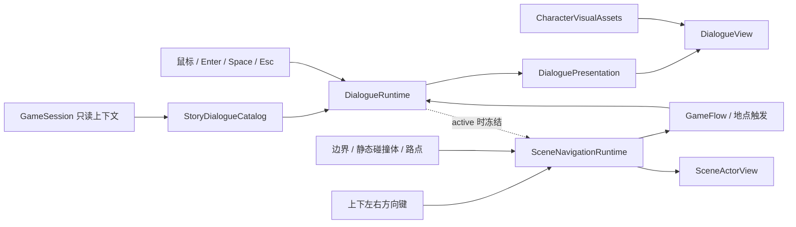

# 人物小人与轻量对话系统规划

## 目的与阶段定位

本文定义 P4 人物小人、统一对话框和主角/NPC 对话的实施边界。当前先用稳定的占位视觉规格跑通共享基础和各场景垂直切片；基础功能、输入、字体和截图验收稳定后，再由 Issue 17 统一替换最终 imagegen/人工处理资产。

该功能承接 `docs/story/LOCATIONS_AND_NPCS.md` 的镇长、餐馆老板、便利店店主、图书馆管理员、酒保和主角自我独白，但不把项目扩展为对话树、好感度、恋爱、任务链或开放世界 NPC 系统。

## 已确认决定

- 对话采用短小线性脚本，不提供分支选项。
- 人物和对话只负责展示与输入，不直接修改金钱、属性、天数、库存、酒馆战绩或结局。
- 对话打开时是模态层，必须优先消费输入并冻结地点计时；关闭后恢复原流程。
- 第一版不保存对话行进度或已读标记；从阶段边界恢复时允许重播无奖励对话。
- 第一版不新增地点访问次数、好感度或 NPC 进度，不改变 v1 存档格式。
- 若后续必须实现“一生只出现一次”或按访问次数变化的熟悉对话，需单独评估 v2 存档迁移，不在本批次顺手加入。
- 最终剧情回收继续使用现有每日总结、评议会和结局入口，不新增 `GamePhase`。
- 小镇地图保持静态热点；有限角色移动只进入图书馆和酒馆固定室内场景。
- 主角移动仅绑定上下左右方向键，不绑定 WASD；E/Space 与鼠标用于邻近互动。
- 家具、书架、柜台、吧台、桌椅和墙体必须有与视觉一致的静态碰撞体，主角和巡逻 NPC 均不可进入。
- 餐馆、便利店、图书馆和家从地图进入后先显示场景大厅；大厅 NPC 热点可以先使用程序占位，但在正式对话接入前只显示预留提示，不修改行动阶段或玩家状态。点击主要活动后再进入原有玩法/休息确认。
- 部分 NPC 可以使用可复现的作者路点和停留行为，但不保存跨日位置，不实现全局寻路或动态避障。

## 首版角色与触发矩阵

| 触发点 | 对话角色 | 首版目标 | 对流程的影响 |
| --- | --- | --- | --- |
| 新游戏确认后 | 镇长、主角 | 地图、钥匙和十日约定，3-4 句 | 对话结束后进入第一日地图 |
| 餐馆大厅 NPC 热点 | 餐馆老板、主角 | 围裙、订单和服务节奏，2-3 句 | 对话关闭后才进入餐馆工作准备；倒计时不提前启动 |
| 便利店大厅 NPC 热点 | 便利店店主、主角 | 天气、库存和账本，2-3 句 | 对话关闭后才进入进货、定价和销售流程 |
| 图书馆大厅/室内管理员热点 | 管理员、主角 | 分类、借书卡和旧地图，2-3 句 | 大厅先提供预留入口；Issue 27 后由室内邻近互动进入读者咨询/书籍整理选择 |
| 酒馆室内靠近酒保 | 酒保、主角 | 桌游、赌注和夜晚规矩，2-3 句 | 迁移现有酒保硬编码弹窗 |
| 家中大厅热点/准备休息 | 主角独白或访客 | 热水、日记和明天，1-2 句 | 大厅互动不消耗阶段；确认休息后才应用既有收益与总结 |
| 第十日收束 | 镇长与地点回声 | 继续由评议会和唯一主结局收束 | 不新增可持久化阶段 |

每句正文以 32-36 个中文字符为建议上限；一个对话框最多显示三行，超长文本必须分页或压缩，不能越出 960×540 逻辑画布。

## 占位人物视觉规格

首轮开发锁定接口和槽位，不锁定最终人物造型：

| 项目 | 首轮规格 |
| --- | --- |
| 原生人物帧 | 32×32 px，透明背景，最近邻采样 |
| 待机动画 | 可选 4 帧横排，128×32 px；没有动画时允许单帧 |
| 移动动画 | 4 个方向、每方向最多 4 帧；推荐 128×128 px 图集，首轮允许单帧或程序占位 |
| 场景显示 | 原生 1× 或 2× 整数倍，不做平滑缩放和任意旋转 |
| 对话人物槽 | 复用人物帧按 2× 显示，槽位约 72×72 设计单位 |
| 对话框 | 640×360 设计网格底部约 `48,226,544,116`，映射到 960×540 逻辑画布 |
| 文本 | 角色名、正文、行进度和继续/跳过按钮全部由程序字体绘制 |
| 失败回退 | 图片缺失时使用程序绘制的人物轮廓与姓名，不阻断规则测试 |

建议运行时命名为 `<character>_<action>_<direction>_<frames>f.png`，例如 `mayor_idle_down_4f.png`。现有 64×64 六帧酒保素材作为候选兼容输入，由视觉注册表适配；Issue 17 再决定重采样、重新生成或替换。

imagegen 适合生成统一人物设定稿和透明/色键候选小人，但最终 sprite 需要在原生尺寸人工检查轮廓、帧对齐和透明边缘。进入发布包的生成资产必须保留原始图、处理图、用途、hash 和人工验收记录。

## 推荐架构

### 剧情目录

raylib-free 的剧情目录拥有角色标识、触发标识、说话人和线性台词。它可以读取天数、地点和既有只读属性选择已确认脚本，但不拥有 UI 状态，也不修改游戏会话。

首版文本量有限，优先使用小而明确的 C++ 数据结构，并从目录本身汇总字体字形。暂不引入 JSON、通用内容编辑器或新的外部依赖；只有文本规模显著增长后再评估简单数据文件。

### 对话运行期

`DialogueRuntime` 采用与 `TavernRuntime` 相似的窄接口：打开脚本、接收显式帧输入、返回只读 presentation、查询是否 active。运行期只保存当前脚本和行号；继续、跳过和关闭不会应用行动结果。

对话 active 时，应用必须先更新对话并立即返回，不能继续更新餐馆倒计时、便利店输入、图书馆答题或酒馆挑战。对话关闭后由原场景继续。

### 对话展示与人物资源

展示层只读取 presentation 和人物资源注册表，统一绘制背景遮罩、人物槽、姓名、正文、页码和按钮。文字使用共享 UTF-8 限行布局；禁止重新复制图书馆当前按字节遍历中文的换行实现。

人物纹理加载、帧尺寸和 fallback 集中在 `CharacterVisualAssets`，地点页面不自行加载同一角色，也不把资源路径写入规则层。

### 有限室内移动与 NPC 行为

`SceneNavigationRuntime` 是 raylib-free 的场景展示运行期，只服务图书馆和酒馆。它接收上下左右方向键意图和帧时间，返回主角/NPC 的位置、朝向、动画状态与可互动目标，不拥有地点规则或玩家属性。

场景布局显式定义可行走边界、出生点、互动半径、静态矩形碰撞体和 NPC 路点。移动采用轴分离碰撞；同时按下两个方向时归一化速度。主角和 NPC 都不得穿过家具、书架、柜台、吧台、桌椅或墙体。后续加入、移动或缩放家具和书架时，必须在同一变更中同步碰撞数据，不能只更新背景图片。

管理员或酒馆常客可按有限路点循环、往返或停留；酒保等固定岗位 NPC 可以原地待机。首版不做 A*、动态避障、跨场景日程或位置持久化。每次进入场景均从确定起点重置；打开对话、暂停或窗口失焦时所有角色停止。

### 与现有模块的关系

- 酒馆：先把 `tavern_view` 中硬编码的酒保文案迁移到剧情目录；随后接入固定室内移动，靠近酒保或桌面热点后进入既有对话和挑战流程。现有酒保素材继续候选使用。
- 图书馆：保留题库、整理任务和各自规则引擎，把 `npc_talk` 文案与弹窗迁移到共享对话系统；随后接入固定室内移动，靠近管理员后进入既有对话与工作模式选择。图书馆专用 `NpcManager` 不升级为全项目领域 NPC 系统。
- 餐馆和便利店：对话只发生在计时/经营输入开始前，关闭后继续既有教程和玩法。
- 主流程：`game_flow` 只触发脚本并渲染 overlay，不拥有长台词、人物资源细节或对话推进分支。
- 核心和存档：只提供上下文，首版不增加字段、不改变阶段和格式版本。

## 输入与可用性

- 图书馆和酒馆室内使用上下左右方向键移动，不绑定 WASD；E/Space 触发邻近目标，鼠标点击邻近目标提供等价入口。
- 鼠标点击对话框或“下一句”继续；Enter/Space 提供等价快捷键。
- Esc 跳过当前无奖励对话并回到原流程；不能同时触发场景返回或主动放弃。
- 对话框显示角色名、当前行/总行数和明确的继续/跳过提示。
- 对话打开时暂停地点计时和动画；窗口失焦仍遵循全局暂停规则。
- 人物图片缺失时仍能依靠姓名和程序轮廓完成对话，不出现空白页。
- 新增台词必须进入模块字形清单，诊断截图中不得出现 A 替代字形或文字越界。

## 测试与验收证据

自动化测试至少覆盖：

- 剧情目录包含所有已确认角色、触发点和非空台词。
- 相同脚本和输入产生相同 presentation，继续、跳过和关闭不会重复推进。
- 对话 active 时地点输入被拦截，餐馆计时等状态不变化。
- 酒保、餐馆老板、便利店店主、图书馆管理员、镇长和主角各有一条从触发到关闭的端到端路径。
- 图书馆与酒馆的方向键移动、斜向归一化、边界、静态障碍碰撞、确定性 NPC 轨迹和场景重入重置均有无窗口测试。
- 对话 active 时主角和 NPC 位置不变化，关闭后恢复同一室内状态。
- 存档字段、玩家状态和行动结果在纯展示对话前后保持不变。
- 所有对话文本进入字体加载清单，UTF-8 分页不会拆分中文字符。
- 对话框、人物槽和按钮位于 960×540 内，正文最多三行。

人工证据至少包含酒保、餐馆老板、便利店店主、管理员、镇长/主角和回家独白截图；Issue 17 再验收最终人物一致性、原生像素清晰度、调色板、资源许可和 imagegen 归档。

## 实施顺序与 issue 对应

1. Issue 23：用酒保现有入口跑通共享剧情目录、Runtime、对话框和人物资源回退。
2. Issue 24：接入餐馆老板静态地点对话。
3. Issue 25：接入便利店店主静态地点对话，可与 Issue 24 并行。
4. Issue 26：接入镇长/主角开场与回家独白，保持十日状态机和 v1 存档不变；可与地点切片并行。
5. Issue 29：在保留读者咨询的前提下新增书籍整理模式和模式选择；该规则切片不依赖室内移动，可先独立完成。
6. Issue 27：接入图书馆固定室内移动、书架/家具碰撞、管理员轨迹和对话到工作模式选择的完整路径。
7. Issue 28：复用导航边界接入酒馆室内移动、吧台/桌椅碰撞、常客轨迹和既有挑战入口。
8. Issue 16：结合试玩批准 NPC 文案长度、语气、内容密度、整理数值和室内移动手感；不新增复杂关系系统。
9. Issue 17：统一替换最终人物、对话框装饰和地点视觉，并同步验收家具/书架等视觉物件与碰撞体，完成来源、hash、许可和人工视觉验收。
10. Issue 18：在 Windows 发布包和演示路径中验证全部对话、移动、碰撞、fallback、字体与资源清单。

## 明确不做

- 分支对话树和玩家选项。
- 好感度、恋爱、任务、礼物或 NPC 独立属性。
- NPC 跨日位置、小镇主地图或开放世界自由探索、全局寻路、动态避障或复杂动态碰撞。
- 对话奖励和一次性领取逻辑。
- 为首版对话升级存档格式。
- 在生成图片中烘焙中文姓名或台词。
