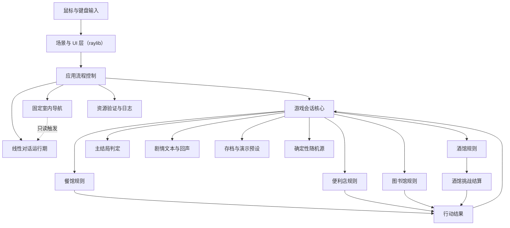
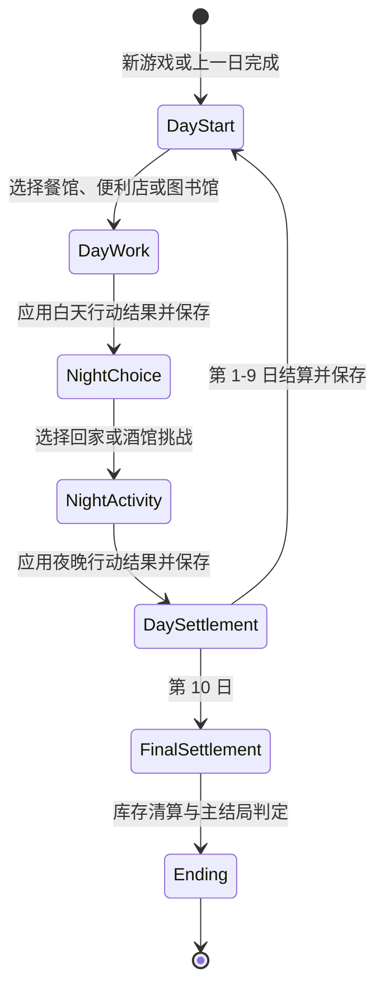
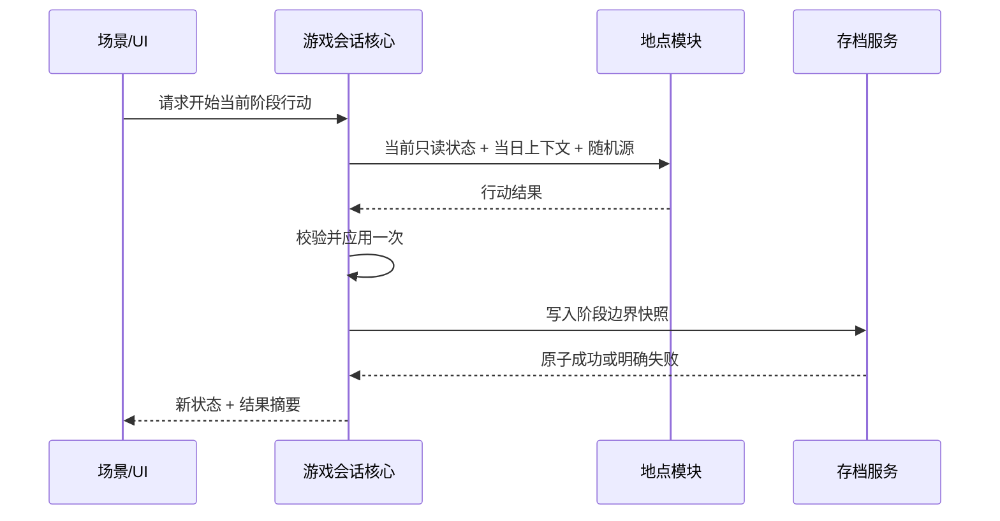

# 《像素小镇：十日经营计划》核心设计说明

## 目的与边界

本文描述 MVP 的稳定架构边界和模块契约，作为 P0-P4 实施依据。产品行为以 PRD 和 `CONTEXT.md` 为准；具体类名、源文件布局和数值参数由对应 issue 在不破坏本文约束的前提下确定。

设计目标：

- 地点玩法可以由不同成员并行实现。
- 领域规则可以脱离 raylib 窗口自动化测试。
- 同一行动结果最多应用一次。
- 随机事件、存档恢复和演示预设可以复现。
- 从第一天到第十天的产品闭环始终优先于内容数量。

## 总体结构

## 依赖规则

1. 领域核心和地点规则不得包含或暴露 raylib 类型。
2. UI 可以读取只读状态并发送用户意图，但不能直接修改玩家状态、天数、库存或酒馆战绩。
3. 地点模块只能返回行动结果；核心系统是全局状态的唯一写入者。
4. 存档层负责序列化已确认的快照，不拥有游戏规则。
5. 随机性通过显式随机源或种子传入，不允许模块自行使用不可追踪的全局随机状态。
6. 数值平衡参数由核心配置集中提供，不散落在 UI 和规则分支中。
7. 剧情文本入口属于 raylib-free 领域边界；UI 只显示文本，不拥有长剧情正文或结局文案选择逻辑。
8. 应用采用单线程主循环；MVP 不为规则计算、资源加载或 AI 引入后台并发。
9. 固定室内导航的移动、碰撞和路点推进必须能够脱离 raylib 测试；绘制层只把方向键输入转换为显式意图并读取 presentation。
10. 场景角色位置属于应用展示状态，不得写入 `PlayerState`、地点规则、行动结果或 v1 存档。

## 核心概念模型

### 游戏会话

游戏会话拥有当前玩家状态、游戏日、阶段、店铺库存、酒馆战绩、随机种子和已完成阶段记录。它提供以下能力：

- 创建新游戏或从快照恢复。
- 查询当前阶段允许的行动。
- 开始一个地点模块或回家休息。
- 接收且只接收一次行动结果。
- 完成每日结算并推进游戏日。
- 在第十日完整结算后执行最终库存清算和主结局判定。

### 玩家状态

玩家状态包含金钱、体力、声望、知识和心情。具体初值、边界和变化量属于数值平衡参数；状态更新必须集中裁剪到合法范围，并生成可展示的变化摘要。

心情修正由核心系统统一应用，不由餐馆、便利店或图书馆各自实现。地点模块返回未修正的基础行动结果和表现摘要；核心读取集中数值配置，根据行动前或行动结算时的心情档位生成一条可展示的修正项，再与基础结果合并并裁剪到合法范围。P1-P3 只固定这条数据流和可解释性要求，具体阈值、倍率和上下限在 P4 数值平衡中批准。

### 当日上下文

当日上下文是一个游戏日内共享的只读输入，至少包含游戏日、天气、事件提示和可复现随机信息。同一日重复加载或异常恢复时，上下文必须保持一致。

### 行动结果

行动结果是地点模块提交给核心的不可变结果，表达：

- 通用属性变化。
- 地点专属记录变化，例如库存或酒馆战绩。
- 用于每日总结的可读摘要。
- 完成、主动放弃等结果类别。
- 防止同一结果重复提交的会话身份。

行动结果不负责保存、推进天数或选择结局。

### 剧情文本与回声

剧情文本负责把阶段、地点、行动结果和结局转换为可展示的生活叙事。它遵循 `docs/story/` 下的剧情契约，P1 先接入 S 级静态文本，P2/P3 再由地点统计和结局判定补充回声。

剧情文本层必须满足：

- 不依赖 raylib。
- 不直接修改玩家状态、天数、库存、酒馆战绩或存档。
- 不拥有地点规则；地点模块只提供表现统计或行动结果。
- 不引入复杂好感度、对话树、任务链或开放世界剧情系统。
- 新增文本必须进入字体字形覆盖检查。
- 规则或运行期拼接的动态中文文案必须由所属 Module 提供字形清单并汇入启动字体加载，不能只依赖 UI 手工猜测字符。
- 若未来需要保存路线统计或 NPC 进度，必须作为存档格式变更单独评估并测试。

### 固定室内导航

只有图书馆和酒馆拥有固定镜头室内导航。小镇地图、餐馆和便利店继续使用静态热点或面板交互，不共享角色移动状态。

餐馆、家、图书馆、酒馆和便利店的 960×540 合成稿可以登记用于视觉审查的静态碰撞元数据；其中餐馆、家和便利店的碰撞箱当前只用于 F3 对齐检查和后续扩展预留，不代表 MVP 已开放这些场景的角色移动。图书馆和酒馆布局分别由 Issue 27/28 接入实际导航运行期。

导航运行期接收帧时间和显式方向输入，拥有场景角色位置、朝向、移动状态、可行走边界、静态矩形碰撞体和作者配置路点。玩家输入只绑定上下左右方向键，不绑定 WASD；同时按下横向与纵向方向键时应归一化速度，避免斜向移动更快。

主角和巡逻 NPC 均使用稳定、可测试的轴分离矩形碰撞，不得进入家具、书架、柜台、吧台、桌椅或墙体范围。碰撞体属于场景布局契约：新增、移动、缩放或替换阻挡性视觉物件时，必须在同一变更中同步更新碰撞数据并通过截图与碰撞测试。

NPC 首版只使用确定性的作者路点、停留、循环或往返，不实现 A*、动态避障或跨场景日程。每次进入场景时，主角和 NPC 从确定起点重置。对话 active、暂停、失焦或最小化时，玩家移动、NPC 轨迹和地点计时同时冻结。

### 数值平衡配置

数值平衡配置集中提供初始状态、消耗、恢复、奖励、需求倍率、概率、计时、赌注和结局阈值。P0-P3 使用可运行基线；P4 才将人工试玩批准的值视为交付参数。MVP 不提供运行时数值编辑器。

### 最终库存清算与主结局

`EndingRules` 是 raylib-free 的最终结算 Module。它读取第十日夜晚结算后的玩家状态、便利店库存和酒馆战绩，先按集中商品成本与清算比例计算现金，再使用清算后的金钱判定唯一主结局。`GameSession` 只有在第十日 `DaySettlement` 阶段接受该结果，随后清空库存并进入 `Ending`；已经进入结局的会话不能再次清算。

判定顺序固定为：经营失败者 -> 小镇明星经营者 -> 符合条件的单项路线 -> 平凡小镇新人。多个单项路线同时成立时，分别以“实际值 / 路线门槛”比较突出程度；完全并列时使用稳定顺序“赚钱 -> 声望 -> 知识 -> 娱乐”。结局判定只返回枚举、成长路线和可解释依据，七种生活叙事由 `StoryText` 根据枚举选择，UI 不拥有判定或文案分支。

P3 基线按商品进货成本的 50% 向下取整清算，并提供可运行结局阈值；这些值只用于闭环和自动化测试，Issue 16 必须通过固定种子模拟与人工试玩后批准或调整最终参数。调整参数不得改变一次性清算、固定优先级、唯一主结局和可解释依据等契约。

## 游戏阶段状态机

状态机约束：

- 白天工作和夜晚活动在一个游戏日中最多各完成一次。
- 进入地点前返回地图不消耗阶段。
- 地点开始后主动放弃会提交无收益的放弃结果并消耗阶段。
- 异常关闭恢复到最近阶段边界，未完成地点使用相同种子重新开始。
- 属性触底不会提前 Game Over；必须保留无需前置资源的恢复路线。

## 保存点与恢复

存档规则：

- 使用带版本号的行式纯文本格式，不序列化原始内存布局。
- 自动存档位于应用/发布目录旁 `saves/slot1.sav`，只有一个槽位。
- 保存至少发生在日初、白天结果应用后、夜晚结果应用后和每日结算后。
- 写入应先产生临时文件，再以替换方式提交，避免中断留下半个有效文件。
- 解析失败、字段缺失或版本不兼容时保留原文件并展示明确错误。
- 开始新游戏前确认覆盖。
- 演示预设只读加载，不读取或改写正式自动存档。
- 演示预设位于 `assets/data/demo_presets/`，只能通过显式 `--demo-preset <id>` 参数加载，不出现在普通菜单。

## 地点模块契约

每个地点模块必须能够在没有图形窗口的测试中运行其规则，并通过 UI 适配层接入相同流程。

应用层通过窄适配器把地点模块的局部结果转换为核心 `ActionResult`。`src/app/location_result_adapter.*`
当前只处理图书馆结果映射和每日上下文，不直接绘制 UI 或写入全局状态；餐馆、图书馆和便利店的
窗口输入、临时 UI 状态和开始/完成流程集中在 `src/app/location_runtime.*`，避免继续把地点流程堆入
`game_flow.cpp`。酒馆使用独立 `TavernRuntime`：raylib 输入先转换为显式 `TavernFrameInput`，
Runtime 通过 `open / step / presentation / active` Interface 隐藏大厅、棋局、骰局、计时和提交顺序。

CMake 中 `pixel_town_locations` 只承载可无窗口测试的地点规则；五子棋和骗子骰子分别位于
`src/locations/gomoku_rules.*` 与 `src/locations/liars_dice_rules.*`。酒馆终局由
`src/locations/tavern_challenge_settlement.*` 接收真实游戏状态、拒绝未终局挑战、从终局推导胜负，
再校验并构造现有 `ActionResult`；它编入无窗口地点规则目标。
Runtime 与布局编入不链接 raylib、链接地点规则的 `pixel_town_tavern_logic`。需要 raylib 类型的
图书馆场景/NPC 支持放在 `pixel_town_location_scene`；酒馆输入转换、资源和绘制留在 app 展示层。

### 通用生命周期

1. 核心确认当前阶段与资源允许进入。
2. 模块接收只读玩家状态、当日上下文、数值配置和随机源。
3. UI 将用户意图转交规则引擎。
4. 规则引擎推进地点内部状态，直到完成或主动放弃。
5. 模块生成一个行动结果。
6. 核心校验、应用、保存并切换阶段。

核心除结果 ID、阶段、地点和行动槽外，还校验地点专属字段：只有便利店行动可以更新
店铺库存，只有酒馆行动可以更新酒馆战绩，主动放弃不能携带收益或地点状态变化。
生产流程不提供“模拟成功”回退；地点运行状态缺失时明确报错。用于状态机测试和诊断截图的
快速行动结果只存在于测试 helper 或显式诊断代码中。

### 餐馆

- 内部状态：顾客订单、等待状态、已提交菜品和表现统计。
- 输入：菜品选择、提交、暂停或放弃。
- 输出：金钱、体力、声望、心情变化和服务摘要。
- 错单与超时只改变地点内部统计，结束时统一生成行动结果。

### 便利店

- 输入状态：现金、跨日店铺库存、当日提示和价格档位。
- 玩家先决定进货与价格档位，再执行一次销售模拟。
- 便利店规则 Module 在开始地点前明确校验现金和单品库存上限；非法计划保持原样并返回
  可读错误，不由 app 层静默删减玩家选择。
- 需求模型由基础需求、价格、天气/事件和固定种子波动组成。
- 输出包含现金变化、最新库存和经营摘要；未售库存进入下一日。
- 第十日结束后由核心执行最终库存清算，便利店模块本身不选择结局。

### 图书馆

- 类别和读者需求来自仓库数据文件，显示代码不拥有内容定义。
- 一条需求映射到一个正确类别；规则引擎负责匹配和统计。
- 输出包含知识、声望、体力、心情及答题摘要。
- 室内导航只负责让玩家靠近管理员并触发共享对话或现有答题流程；它不改变题库规则，也不把玩法改为逐个书架搜索。

### 酒馆

- 酒馆外壳负责当晚唯一挑战选择、赌注合法性和统一结算。
- 五子棋规则负责棋盘、合法落子、胜负及启发式电脑决策。
- 骗子骰子规则负责隐藏骰子、递增叫点、万能点例外、质疑、揭示和淘汰。
- 两个规则引擎不直接修改金钱、心情或酒馆战绩。
- 挑战开始后，已选择的玩法和赌注保持不变；Settlement Module 只接受真实五子棋或骗子骰子终局，从规则状态推导挑战类型与胜负，再生成统一夜晚 `ActionResult`。
- Runtime 缓存终局首次生成的候选 `ActionResult`。只有核心接受该结果后 Runtime 才结束；核心拒绝时保留同一候选结果、终局棋盘或骰局和错误反馈，便于稳定重试或诊断。
- 酒馆室内导航负责靠近酒保或桌面热点，再进入现有大厅对话、五子棋或骗子骰子流程；它不得改写 `TavernRuntime` 的挑战规则和结算契约。

## 场景与 UI

场景范围固定为：标题、新游戏/继续、小镇地图、餐馆、便利店、图书馆、酒馆选择、五子棋、骗子骰子、每日总结、最终结局和暂停/设置。

- 内部画布 960×540，默认窗口 960×540。
- 使用整数倍缩放和留黑边，输入坐标必须先转换到逻辑画布。
- 页面最终绘制目标始终是 960×540；程序 UI 统一使用 `src/ui/ui_metrics.hpp`
  定义的 640×360 设计网格，经 1.5 倍映射到逻辑画布。
- 室内页面顶部 60 像素为独立状态栏，960×540 场景源图按原始 16:9 比例完整缩放到
  状态栏下方居中的 853.33×480 视口，不裁切、不拉伸，也不再由状态栏覆盖窗户、墙面或
  家具。源图坐标、碰撞框、NPC 与场景热点统一通过 `src/ui/scene_viewport.hpp` 映射；
  浮层面板和固定按钮继续使用屏幕 640×360 设计网格。
- 鼠标为主要输入，常用操作提供键盘快捷键。
- 图书馆与酒馆室内的角色移动仅使用上下左右方向键；E/Space 可作为邻近互动快捷键，鼠标点击邻近 NPC 或热点提供等价互动，不绑定 WASD。
- 对话作为模态层优先消费输入；active 时不得把方向键、E/Space、鼠标或 Esc 泄漏给导航和地点玩法。
- 暂停、失焦和最小化冻结地点计时和动画推进。
- UI 只发送用户意图并渲染状态；场景切换由应用流程控制。
- 从地图点击餐馆、便利店、图书馆或家时，先进入不消耗行动的场景大厅：展示完整背景、返回入口、主要活动按钮和 NPC 预留热点；只有点击主要活动后才调用地点进入/开始逻辑。酒馆继续使用自身专用大厅。
- 通用场景大厅属于应用内临时展示状态，不写入 `GameSession` 或 v1 存档；退出或重启时安全回到对应阶段地图。占位 NPC 热点只反馈“接口已预留”，不得提前修改属性或地点规则。
- 酒馆展示层把 raylib 输入转换为 `TavernFrameInput`，只读取 `TavernPresentation`；骗子骰子揭晓前 presentation 不包含电脑骰面。
- 每个地点首次进入显示可跳过说明，暂停菜单可以重新查看。
- 全局设置只包含静音等已确认能力，不扩展为通用设置系统。
- P2/P3 地点 UI 可以使用程序绘制面板、占位头像框、临时色块或 Kenney 点缀素材先完成逻辑；最终 imagegen 场景、NPC 和装饰 UI 在 P4 统一替换。
- 地点规则不得依赖最终视觉资产是否存在，图片加载失败不能阻断无窗口规则测试。
- 地图提示等可接收运行时摘要的区域必须使用 UTF-8 安全的限行换行或省略布局，不允许把任意长度文本直接单行绘制到固定面板。

### 应用层模块 Seam

P2/P3 合并地点后，应用层按以下 Module 维持 Locality：

- `GameSession`：核心状态机 Module，唯一负责玩家状态、阶段、天数、行动结果应用和结局推进。
- `StoryText`：raylib-free 剧情文本 Module，负责开场、每日提示、地点摘要和结局叙事文本。
- `EndingRules`：raylib-free 最终结算 Module，负责库存折价、固定优先级、单项归一化比较，以及返回唯一主结局、成长路线和判定依据。
- `location_result_adapter`：图书馆结果 Adapter，负责把图书馆内部结果转换为统一 `ActionResult` 并准备每日上下文。
- `location_runtime`：白天地点 UI Adapter，负责餐馆、图书馆和便利店在 app 层的临时运行状态、启动顺序、主动放弃和结果提交；其 `LocationRuntimeState` 另行拥有酒馆视觉资源的生命周期。
- `location_lobby`：raylib-free 场景大厅布局契约，为餐馆、便利店、图书馆和家提供标题、NPC 热点、返回按钮和主要活动按钮；酒馆明确不复用该配置。
- `tavern_runtime`：raylib-free 酒馆流程 Module，以 `open / step / presentation / active` 为 public Interface，接收显式帧输入并隐藏大厅、棋局、骰局、电脑行动和结果提交顺序。
- `tavern_challenge_settlement`：raylib-free 结算 Module，接收真实游戏终局并推导挑战类型与胜负，校验配置、结果 ID、赌注和现金，只构造现有夜晚 `ActionResult`，不应用全局状态。
- `tavern_view`：酒馆只读绘制 Module，使用共享设计网格、`ui_primitives` 和 `TavernVisualAssets`，不直接修改玩法状态、玩家状态、阶段或酒馆战绩。
- `scene_navigation_runtime`：raylib-free 固定室内导航 Module，接收显式帧输入，处理主角移动、静态碰撞、确定性 NPC 路点和邻近互动，并提供只读 presentation。
- `scene_actor_view`：图书馆与酒馆场景角色的只读绘制 Adapter，读取导航 presentation 和人物资源，不拥有碰撞或地点规则。
- `dialogue_runtime`：raylib-free 线性对话 Module，模态拦截导航与地点输入；关闭后把控制权交还原场景，不修改全局状态。
- `ui_primitives`：960×540 逻辑画布绘制 Module，集中缩放、文本、面板、点击和 hover 判断，避免各场景散落坐标转换规则。
- `game_flow`：高层场景路由 Module，只决定当前画面应进入标题、地图、地点、总结或结局，不拥有地点规则细节。

这些 Module 的 Interface 应保持小而稳定。新增地点或替换最终视觉时，优先在 Adapter 后面改变 Implementation，不把 `GameSession`、地点规则或长剧情文案拖回 `game_flow.cpp`。当前酒馆只有两种已确认挑战，不建立全项目通用地点或挑战扩展 Interface；只有出现真实且重复的变化方向后再评估新的 seam。

## 随机性与复现

- 新游戏生成并保存根种子。
- `GameSession` 从根种子、游戏日、地点和地点会话序号集中派生随机种子；`DayContext`
  暴露的是当日种子，地点模块通过 `location_seed()` 获取自己的稳定随机流，避免各模块
  自行发明混合算法，也避免其他模块增加随机调用后改变现有结果。
- 酒馆挑战开始并取得 `active_result_id` 后，用它派生地点种子；相同阶段边界恢复后，骗子骰子掷骰和电脑行为保持可复现。
- 存档恢复和演示预设必须复现相同当日提示和未完成地点内容。
- 测试使用固定种子，不通过重试掩盖不稳定结果。
- 日志记录可用于复现的应用版本、游戏日、阶段和种子，但不记录个人信息。

## 存档

- 当前使用发布目录旁的单槽位 `saves/slot1.sav`，不写入系统级目录。
- 存档是带 `format_version=1` 的行式纯文本，包含随机种子、日数、阶段、玩家状态、地点会话状态、已应用行动结果、摘要文本、便利店库存字段和酒馆战绩字段。
- 进行中的酒馆挑战不进入 v1 存档；异常关闭恢复最近阶段边界，并以相同地点种子重新开始该晚活动。
- 图书馆与酒馆的主角位置、NPC 位置、朝向和路点进度不进入 v1 存档；重新进入或恢复地点时从场景定义的确定起点开始。
- 应用启动时尝试恢复最近阶段边界；损坏、缺字段或版本不兼容时保留原文件并在标题页显示可理解错误。
- 阶段边界保存点包括日初、白天结果应用后、夜晚结果应用后、每日总结后和最终结局。
- 写入先落到同目录临时文件，再通过平台原子替换进入正式槽位，避免半写文件覆盖最后一个有效存档。
- 有已有存档时从标题页开始新游戏需要二次确认；按 Esc 取消时原存档保持不变。
- 全局静音设置保存到应用/发布目录旁 `saves/settings.ini`，不写入系统级配置目录。

## 资源与错误边界

- 启动阶段验证必要字体、贴图和数据清单。
- 必要资源缺失时进入错误页，不进入半可用游戏。
- 音频属于可选表现资源；加载失败可记录并静音运行，不阻塞核心闭环。
- `logs/latest.log` 每次启动覆盖，避免无界增长。
- 所有第三方资源进入 `CREDITS.md` 并随发布包提供许可证。
- 不允许联网下载运行时资源、上传日志或发送遥测。

## 构建与第三方依赖

- C++17、CMake、Visual Studio 2022/MSVC 是 Windows 标准环境。
- raylib 6.0 和 doctest 2.5.2 使用仓库内锁定版本，首次构建不访问网络。
- raylib 只进入平台与表现边界；doctest 测试源与生产源分离。
- CTest 是统一测试入口。
- Windows 和 macOS CI 验证配置、构建与测试；Windows 实机负责最终发布验收。

## 测试结构

### 领域规则测试

- 阶段转换、重复结果拒绝和十日边界。
- 玩家状态合法范围和结果摘要。
- 餐馆订单、错单和超时。
- 便利店需求、跨日库存和最终清算。
- 图书馆分类匹配。
- 五子棋规则与电脑决策优先级。
- 骗子骰子叫点、万能点、质疑和淘汰。
- 酒馆 Settlement 的未终局拒绝、真实终局推导、配置、结果 ID、赌注和资金校验。
- 主结局优先级和回退结局。

### 基础设施测试

- 存档往返、损坏输入、版本错误和原文件保护。
- 固定种子复现。
- 必要资源验证和日志错误路径。
- 演示预设与正式存档隔离。
- 酒馆 Runtime public Interface 的进入/开始、固定种子完整流程、隐藏信息，以及核心拒绝后终局与同一候选结果保留。
- 固定室内导航的边界限制、归一化斜向速度、轴分离碰撞、家具/书架/吧台等静态障碍、确定性 NPC 路点和场景重入重置。
- 共享对话 active 时，方向键、互动输入、NPC 路点和地点计时均被冻结且输入不会泄漏。

### 端到端证据

- 无图形测试完成一条十日周期。
- 每个地点至少一条从场景进入到行动结果应用的集成测试。
- 图书馆和酒馆各有一条“方向键移动 -> 避开静态障碍 -> 靠近目标 -> 对话/玩法 -> 返回原室内场景”的集成路径。
- 人工验证像素清晰度、输入手感、音频、教程、窗口适配和 Windows 发布包。

## 已延后但受控的决定

- 初始属性、属性边界、消耗、恢复和收益。
- 订单、商品、题库、天气和事件数量。
- 各地点时长、难度增长和随机波动。
- 赌注金额、库存清算比例和结局阈值。
- 最终 tile/sprite 尺寸与具体字体文件，由 P0 视觉原型确认。
- 最终日历排期，由截止日期和团队投入时间确定。

这些事项不得改变核心状态机、地点契约、单存档语义或产品范围；若必须改变，应先更新 PRD 和受影响 issue。
