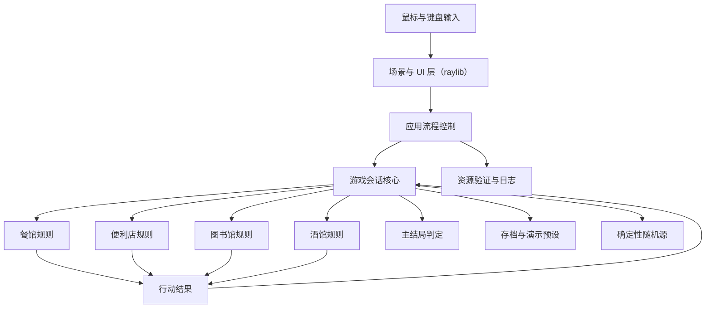
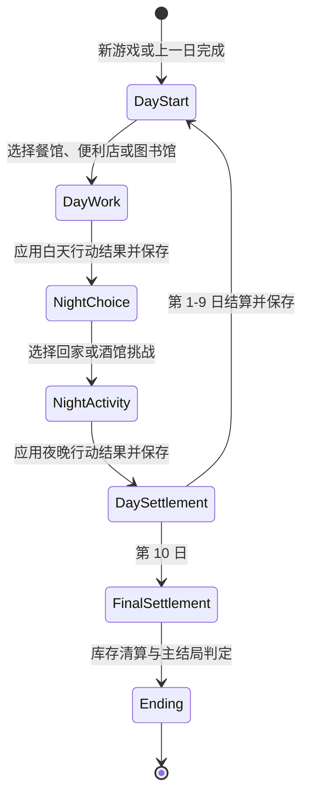
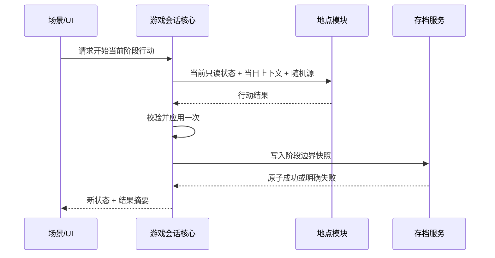

# 《像素小镇：十日经营计划》核心设计说明

## 目的与边界

本文描述 MVP 的稳定架构边界和模块契约，作为 P0-P3 实施依据。产品行为以 PRD 和 `CONTEXT.md` 为准；具体类名、源文件布局和数值参数由对应 issue 在不破坏本文约束的前提下确定。

设计目标：

- 地点玩法可以由不同成员并行实现。
- 领域规则可以脱离 raylib 窗口自动化测试。
- 同一行动结果最多应用一次。
- 随机事件、存档恢复和演示预设可以复现。
- 从第一天到第十天的产品闭环始终优先于内容数量。

## 总体结构

## 依赖规则

1. 领域核心和地点规则不得包含或暴露 raylib 类型。
2. UI 可以读取只读状态并发送用户意图，但不能直接修改玩家状态、天数、库存或酒馆战绩。
3. 地点模块只能返回行动结果；核心系统是全局状态的唯一写入者。
4. 存档层负责序列化已确认的快照，不拥有游戏规则。
5. 随机性通过显式随机源或种子传入，不允许模块自行使用不可追踪的全局随机状态。
6. 数值平衡参数由核心配置集中提供，不散落在 UI 和规则分支中。
7. 应用采用单线程主循环；MVP 不为规则计算、资源加载或 AI 引入后台并发。

## 核心概念模型

### 游戏会话

游戏会话拥有当前玩家状态、游戏日、阶段、店铺库存、酒馆战绩、随机种子和已完成阶段记录。它提供以下能力：

- 创建新游戏或从快照恢复。
- 查询当前阶段允许的行动。
- 开始一个地点模块或回家休息。
- 接收且只接收一次行动结果。
- 完成每日结算并推进游戏日。
- 在第十日完整结算后执行最终库存清算和主结局判定。

### 玩家状态

玩家状态包含金钱、体力、声望、知识和心情。具体初值、边界和变化量属于数值平衡参数；状态更新必须集中裁剪到合法范围，并生成可展示的变化摘要。

心情修正由核心系统统一应用，不由餐馆、便利店或图书馆各自实现。地点模块返回未修正的基础行动结果和表现摘要；核心读取集中数值配置，根据行动前或行动结算时的心情档位生成一条可展示的修正项，再与基础结果合并并裁剪到合法范围。P1-P3 只固定这条数据流和可解释性要求，具体阈值、倍率和上下限在 P4 数值平衡中批准。

### 当日上下文

当日上下文是一个游戏日内共享的只读输入，至少包含游戏日、天气、事件提示和可复现随机信息。同一日重复加载或异常恢复时，上下文必须保持一致。

### 行动结果

行动结果是地点模块提交给核心的不可变结果，表达：

- 通用属性变化。
- 地点专属记录变化，例如库存或酒馆战绩。
- 用于每日总结的可读摘要。
- 完成、主动放弃等结果类别。
- 防止同一结果重复提交的会话身份。

行动结果不负责保存、推进天数或选择结局。

### 数值平衡配置

数值平衡配置集中提供初始状态、消耗、恢复、奖励、需求倍率、概率、计时、赌注和结局阈值。P0-P3 使用可运行基线；P4 才将人工试玩批准的值视为交付参数。MVP 不提供运行时数值编辑器。

## 游戏阶段状态机

状态机约束：

- 白天工作和夜晚活动在一个游戏日中最多各完成一次。
- 进入地点前返回地图不消耗阶段。
- 地点开始后主动放弃会提交无收益的放弃结果并消耗阶段。
- 异常关闭恢复到最近阶段边界，未完成地点使用相同种子重新开始。
- 属性触底不会提前 Game Over；必须保留无需前置资源的恢复路线。

## 保存点与恢复

存档规则：

- 使用带版本号的行式纯文本格式，不序列化原始内存布局。
- 自动存档位于应用/发布目录旁 `saves/slot1.sav`，只有一个槽位。
- 保存至少发生在日初、白天结果应用后、夜晚结果应用后和每日结算后。
- 写入应先产生临时文件，再以替换方式提交，避免中断留下半个有效文件。
- 解析失败、字段缺失或版本不兼容时保留原文件并展示明确错误。
- 开始新游戏前确认覆盖。
- 演示预设只读加载，不读取或改写正式自动存档。
- 演示预设位于 `assets/data/demo_presets/`，只能通过显式 `--demo-preset <id>` 参数加载，不出现在普通菜单。

## 地点模块契约

每个地点模块必须能够在没有图形窗口的测试中运行其规则，并通过 UI 适配层接入相同流程。

### 通用生命周期

1. 核心确认当前阶段与资源允许进入。
2. 模块接收只读玩家状态、当日上下文、数值配置和随机源。
3. UI 将用户意图转交规则引擎。
4. 规则引擎推进地点内部状态，直到完成或主动放弃。
5. 模块生成一个行动结果。
6. 核心校验、应用、保存并切换阶段。

### 餐馆

- 内部状态：顾客订单、等待状态、已提交菜品和表现统计。
- 输入：菜品选择、提交、暂停或放弃。
- 输出：金钱、体力、声望、心情变化和服务摘要。
- 错单与超时只改变地点内部统计，结束时统一生成行动结果。

### 便利店

- 输入状态：现金、跨日店铺库存、当日提示和价格档位。
- 玩家先决定进货与价格档位，再执行一次销售模拟。
- 需求模型由基础需求、价格、天气/事件和固定种子波动组成。
- 输出包含现金变化、最新库存和经营摘要；未售库存进入下一日。
- 第十日结束后由核心执行最终库存清算，便利店模块本身不选择结局。

### 图书馆

- 类别和读者需求来自仓库数据文件，显示代码不拥有内容定义。
- 一条需求映射到一个正确类别；规则引擎负责匹配和统计。
- 输出包含知识、声望、体力、心情及答题摘要。

### 酒馆

- 酒馆外壳负责当晚唯一挑战选择、赌注合法性和统一结算。
- 五子棋规则负责棋盘、合法落子、胜负及启发式电脑决策。
- 骗子骰子规则负责隐藏骰子、递增叫点、万能点例外、质疑、揭示和淘汰。
- 两个规则引擎不直接修改金钱、心情或酒馆战绩。

## 场景与 UI

场景范围固定为：标题、新游戏/继续、小镇地图、餐馆、便利店、图书馆、酒馆选择、五子棋、骗子骰子、每日总结、最终结局和暂停/设置。

- 内部画布 960×540，默认窗口 960×540。
- 使用整数倍缩放和留黑边，输入坐标必须先转换到逻辑画布。
- 鼠标为主要输入，常用操作提供键盘快捷键。
- 暂停、失焦和最小化冻结地点计时和动画推进。
- UI 只发送用户意图并渲染状态；场景切换由应用流程控制。
- 每个地点首次进入显示可跳过说明，暂停菜单可以重新查看。
- 全局设置只包含静音等已确认能力，不扩展为通用设置系统。

## 随机性与复现

- 新游戏生成并保存根种子。
- 每个游戏日和地点会话从稳定标识派生自己的随机序列，避免其他模块增加随机调用后改变现有结果。
- 存档恢复和演示预设必须复现相同当日提示和未完成地点内容。
- 测试使用固定种子，不通过重试掩盖不稳定结果。
- 日志记录可用于复现的应用版本、游戏日、阶段和种子，但不记录个人信息。

## 存档

- 当前使用发布目录旁的单槽位 `saves/slot1.sav`，不写入系统级目录。
- 存档是带 `format_version=1` 的行式纯文本，包含随机种子、日数、阶段、玩家状态、地点会话状态、已应用行动结果、摘要文本、便利店库存占位字段和酒馆战绩占位字段。
- 应用启动时尝试恢复最近阶段边界；损坏、缺字段或版本不兼容时保留原文件并在标题页显示可理解错误。
- 阶段边界保存点包括日初、白天结果应用后、夜晚结果应用后、每日总结后和最终结局。
- 写入先落到同目录临时文件，再通过平台原子替换进入正式槽位，避免半写文件覆盖最后一个有效存档。
- 有已有存档时从标题页开始新游戏需要二次确认；按 Esc 取消时原存档保持不变。
- 全局静音设置保存到应用/发布目录旁 `saves/settings.ini`，不写入系统级配置目录。

## 资源与错误边界

- 启动阶段验证必要字体、贴图和数据清单。
- 必要资源缺失时进入错误页，不进入半可用游戏。
- 音频属于可选表现资源；加载失败可记录并静音运行，不阻塞核心闭环。
- `logs/latest.log` 每次启动覆盖，避免无界增长。
- 所有第三方资源进入 `CREDITS.md` 并随发布包提供许可证。
- 不允许联网下载运行时资源、上传日志或发送遥测。

## 构建与第三方依赖

- C++17、CMake、Visual Studio 2022/MSVC 是 Windows 标准环境。
- raylib 6.0 和 doctest 2.5.2 使用仓库内锁定版本，首次构建不访问网络。
- raylib 只进入平台与表现边界；doctest 测试源与生产源分离。
- CTest 是统一测试入口。
- Windows 和 macOS CI 验证配置、构建与测试；Windows 实机负责最终发布验收。

## 测试结构

### 领域规则测试

- 阶段转换、重复结果拒绝和十日边界。
- 玩家状态合法范围和结果摘要。
- 餐馆订单、错单和超时。
- 便利店需求、跨日库存和最终清算。
- 图书馆分类匹配。
- 五子棋规则与电脑决策优先级。
- 骗子骰子叫点、万能点、质疑和淘汰。
- 主结局优先级和回退结局。

### 基础设施测试

- 存档往返、损坏输入、版本错误和原文件保护。
- 固定种子复现。
- 必要资源验证和日志错误路径。
- 演示预设与正式存档隔离。

### 端到端证据

- 无图形测试完成一条十日周期。
- 每个地点至少一条从场景进入到行动结果应用的集成测试。
- 人工验证像素清晰度、输入手感、音频、教程、窗口适配和 Windows 发布包。

## 已延后但受控的决定

- 初始属性、属性边界、消耗、恢复和收益。
- 订单、商品、题库、天气和事件数量。
- 各地点时长、难度增长和随机波动。
- 赌注金额、库存清算比例和结局阈值。
- 最终 tile/sprite 尺寸与具体字体文件，由 P0 视觉原型确认。
- 最终日历排期，由截止日期和团队投入时间确定。

这些事项不得改变核心状态机、地点契约、单存档语义或产品范围；若必须改变，应先更新 PRD 和受影响 issue。
