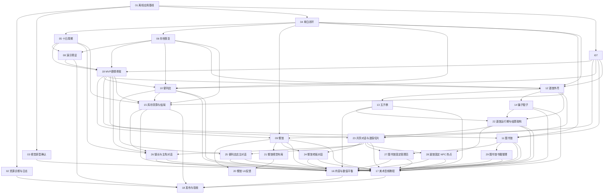

# 《像素小镇：十日经营计划》项目计划

## 目标

以五个阶段交付一个可离线构建、可测试、可从新游戏运行至第十天主结局的 Windows 像素风模拟经营作品。每个阶段具有明确完成门槛，不以代码量或素材数量代替端到端可运行证据。

## 执行原则

- issue 采用 tracer-bullet 垂直切片；每个切片完成后必须可演示或可独立验证。
- 阶段编号表示产品成熟度，不表示代码目录或团队成员。
- “Blocked by”只记录真实依赖；同一阶段无依赖的 issue 可以并行。
- issue 只有在 `Status: ready-for-agent` 且 `Blocked by` 已完成时才能自动启动；阶段门槛用于判断整个阶段能否宣布完成，不额外制造虚假串行依赖。
- AFK issue 可独立执行；HITL issue 必须经过人工视觉确认、试玩或发布验收。
- `main` 始终保持可构建。后续阶段不得破坏已通过的阶段门槛。
- 具体日历日期尚未确定，当前按门槛推进；演示前七天冻结功能。

## 阶段总览

| 阶段 | 目标 | 最早启动条件 | 完成门槛 |
| --- | --- | --- | --- |
| P0 | 工程基线 | 产品契约、技术栈和 ADR 已确认 | 离线构建、测试、CI、资源错误页和视觉规格成立 |
| P1 | 核心闭环 | 对应 P0 blocker 完成 | 模拟地点结果可跑通十日周期、存档恢复、演示预设和占位结局 |
| P2 | 白天玩法 | 单日闭环及对应交互/存档 blocker 完成 | 餐馆、便利店、图书馆均通过真实 UI 返回统一行动结果 |
| P3 | 夜晚与结局 | 单日闭环、存档和交互外壳完成 | 酒馆双玩法、最终库存清算和七种主结局进入完整循环 |
| P4 | 交付打磨 | 对应完整玩法 blocker 完成 | 内容、平衡、像素表现、音频、署名、发布包和演示验收完成 |

## 依赖图

## P0：工程基线

目标是证明团队能够从干净检出离线构建同一项目、运行同一测试入口，并在缺少资源时得到可诊断反馈。

| Issue | 类型 | 依赖 | 独立证据 |
| --- | --- | --- | --- |
| [01 建立可离线复现的应用基线](../.scratch/pixel-town-ten-day-plan/issues/01-p0-offline-app-baseline.md) | AFK | 无 | Windows/macOS 构建、raylib 窗口、CTest 和 CI |
| [02 提供启动资源诊断与本地日志](../.scratch/pixel-town-ten-day-plan/issues/02-p0-resource-diagnostics-and-log.md) | AFK | 01 | 正常启动与缺失资源错误路径 |
| [03 确认像素视觉原型与资源规范](../.scratch/pixel-town-ten-day-plan/issues/03-p0-visual-prototype-approval.md) | HITL | 01 | 人工批准的画布、字体、调色板和素材规范 |

P0 门槛：五名成员可在约定工具链上完成离线配置与构建；CI 可运行；视觉规格不再阻塞基础 UI。

## P1：核心闭环

目标是优先完成一个没有真实地点内容但已经具备时间、状态、存档和结局的可玩骨架。

| Issue | 类型 | 依赖 | 独立证据 |
| --- | --- | --- | --- |
| [04 跑通一个完整游戏日](../.scratch/pixel-town-ten-day-plan/issues/04-p1-one-day-vertical-loop.md) | AFK | 01 | 新游戏到首日结算 |
| [05 扩展为十日周期与占位主结局](../.scratch/pixel-town-ten-day-plan/issues/05-p1-ten-day-cycle.md) | AFK | 04 | 十日无图形集成测试与可见结局 |
| [06 实现阶段边界自动存档与恢复](../.scratch/pixel-town-ten-day-plan/issues/06-p1-save-and-resume.md) | AFK | 04 | 各阶段保存、恢复和损坏处理 |
| [07 完成窗口、输入、暂停与静音外壳](../.scratch/pixel-town-ten-day-plan/issues/07-p1-interaction-shell.md) | AFK | 01 | 960×540 交互外壳、暂停、失焦冻结和静音已完成 |
| [08 实现隔离的演示预设加载](../.scratch/pixel-town-ten-day-plan/issues/08-p1-demo-presets.md) | AFK | 05、06 | 参数加载预设且正式存档不变 |
| [19 接入 MVP 主线剧情骨架](../.scratch/pixel-town-ten-day-plan/issues/19-p1-mvp-story-shell.md) | AFK | 05、06、07、08 | 已完成：开场、每日提示、地点摘要、评议会和占位结局文案 |

P1 门槛：从标题开始可连续完成十天；阶段不可重复；退出后可恢复；演示预设与玩家存档隔离；MVP 主线剧情文本已进入核心闭环。

## P2：白天玩法

三个地点 issue 在各自明确的 P1 blocker 完成后并行，均通过统一地点契约返回行动结果；P1 尚未达到整体门槛时不能宣告 P1 完成。

P2 允许使用占位 UI 完成地点逻辑和测试。最终 NPC、场景背景、按钮装饰和统一结算表现不作为 P2 完成前提，按 [`UI_ASSET_STRATEGY.md`](UI_ASSET_STRATEGY.md) 留到 P4 统一收口。

2026-07-09 集成说明：`codex/integrate-team-branches` 已合入餐馆、便利店和图书馆模块的规则、基础 UI 和测试。地点结果映射和地点运行期流程已先拆到 `location_result_adapter` / `location_runtime`，详见 [`TEAM_BRANCH_INTEGRATION.md`](TEAM_BRANCH_INTEGRATION.md)。P2 自动化闭环已完成；便利店已支持鼠标与键盘两种商品级进货/定价操作，并提供选中、预算、边界、锁定和销售结算反馈。三个白天地点的最终视觉与便利店逐商品销售明细留到后续 polish。

| Issue | 类型 | 依赖 | 独立证据 |
| --- | --- | --- | --- |
| [09 接入完整餐馆白天工作](../.scratch/pixel-town-ten-day-plan/issues/09-p2-restaurant-work.md) | AFK | 04、07、19 | 订单、计时、错单、结算和餐馆叙事摘要闭环 |
| [20 餐馆 UI、提示与操作反馈收口](../.scratch/pixel-town-ten-day-plan/issues/20-p2-restaurant-ui-feedback.md) | AFK | 09、21 | 说明卡、订单票据、食物按钮、倒计时、反馈和结算页可读 |
| [21 餐馆背景、食物与时间表现视觉规划](../.scratch/pixel-town-ten-day-plan/issues/21-p2-restaurant-visual-assets-and-layout.md) | AFK | 09 | 餐馆背景、食物图标、时间条和 fallback 资源槽位明确 |
| [10 接入跨日库存的便利店经营](../.scratch/pixel-town-ten-day-plan/issues/10-p2-convenience-store.md) | AFK | 04、06、07、19 | 进货、价格档位、需求、库存、存档和便利店叙事摘要 |
| [11 接入数据驱动的图书馆工作](../.scratch/pixel-town-ten-day-plan/issues/11-p2-library-work.md) | AFK | 04、07、19 | 数据题库、分类匹配、奖励和图书馆叙事摘要闭环 |

P2 门槛：三个地点都能从地图进入、完成、返回，并由核心系统准确应用行动结果；餐馆和图书馆至少达到“可理解、可操作、可复查截图”的 UI 质量，不把仅有规则测试视为玩家体验完成。

## P3：夜晚与结局

酒馆外壳在单日闭环、存档和交互外壳完成后即可与 P2 三个白天地点并行。五子棋、骗子骰子和正式结局在酒馆战绩契约稳定后可以并行；阶段完成门槛仍要求三者全部完成，且最终结局依赖便利店库存。

P3 继续允许占位 UI，只要求酒馆和结局流程可操作、可测试、可解释；最终酒馆室内背景、NPC 表现、评议会和结局页美术在 P4 统一替换。

2026-07-10 集成说明：`codex/integrate-team-branches` 已从 `origin/dev-ckz@6ebaddd` 分层移植五子棋、骗子骰子和酒馆候选素材。Issue 13/14 的真实玩法已替换模拟成功外壳；Issue 22 进一步以显式帧输入、只读 presentation 和独立 Settlement Module 收口酒馆流程。Issue 15 已加入一次性最终库存清算、七种正式主结局、可解释路线/依据和结局存档恢复。规则与 Runtime 可无窗口测试，统一 `ActionResult`、玩家属性边界和 v1 存档格式未改变。

| Issue | 类型 | 依赖 | 独立证据 |
| --- | --- | --- | --- |
| [12 接入酒馆选择、赌注与夜晚结算](../.scratch/pixel-town-ten-day-plan/issues/12-p3-tavern-shell.md) | AFK | 04、06、07、19 | 每晚一次挑战选择、统一结算和夜晚叙事摘要 |
| [13 接入自由五子棋和电脑对手](../.scratch/pixel-town-ten-day-plan/issues/13-p3-gomoku.md) | AFK | 12 | 完整棋局、规则测试和启发式 AI |
| [14 接入 1v1 骗子骰子](../.scratch/pixel-town-ten-day-plan/issues/14-p3-liars-dice.md) | AFK | 12 | 完整淘汰赛、质疑和万能点规则 |
| [22 深化酒馆运行期与挑战结算架构](../.scratch/pixel-town-ten-day-plan/issues/22-p3-tavern-runtime-and-settlement-architecture.md) | AFK | 12、13、14 | 窄 Runtime Interface、隐藏信息 presentation、真实终局结算、稳定重试和无窗口集成测试 |
| [15 完成库存清算与七种主结局](../.scratch/pixel-town-ten-day-plan/issues/15-p3-endings.md) | AFK | 05、06、10、12、19 | 第十日完整结算、评议会与唯一主结局 |

P3 门槛：玩家可选择回家或一种酒馆挑战；酒馆运行期、隐藏信息和结算 seam 有无窗口集成测试；第十天后完成库存清算并生成可解释的唯一主结局。

2026-07-10：P3 自动化代码门槛已达到；结局阈值、视觉表现和 Windows 实机交付仍分别由 Issue 16-18 的 HITL 验收收口。

## P4：交付打磨

人物小人和轻量对话采用可替换占位视觉先完成基础功能，再由最终视觉 issue 统一替换。所有 NPC 固定在柜台或作者指定热点循环待机动画，不加入主角移动、NPC 巡逻、路点或运行时碰撞；触发矩阵、输入拦截和存档约束见 [`CHARACTER_DIALOGUE_PLAN.md`](CHARACTER_DIALOGUE_PLAN.md)。Issue 23-29 是可自动实施的垂直切片；人物造型、热点可发现性和最终文案密度仍分别由 Issue 16/17 人工批准。

2026-07-11 临时执行调整：Issue 23 保持完成；Issue 24-28 最初改为 `needs-info`，先按 [`SCENE_ASSET_PRODUCTION_PLAN.md`](SCENE_ASSET_PRODUCTION_PLAN.md) 完成视觉输入。2026-07-13 团队提供的餐馆、家、图书馆、酒馆和便利店 960×540 合成稿已接入。2026-07-14 用户恢复以现有主线为基准的地点初识对话实施，Issue 24 已完成；Issue 25/26 仍保持 `needs-info`，其既有依赖和验收标准不因此失效。

2026-07-13 入口流程调整：餐馆、便利店、图书馆和家在地图点击后先进入临时场景大厅，展示完整背景、返回按钮、主要活动入口和 NPC 占位热点；大厅不进入 `GameSession` 阶段、不消耗行动、不写入 v1 存档。酒馆继续使用专用大厅。正式 NPC 台词与模态对话仍按 Issue 24/25/27 接入，不把占位提示视为相关 Issue 完成。

2026-07-14 图书馆玩法调整：Issue 29 已以新增模式接入书籍整理，原 Issue 11 读者咨询继续保留；进入图书馆行动后先选择模式，两者共享数据加载、场景视口和核心统一结算。

2026-07-14 固定 NPC 架构收敛：撤回尚未提交的主角移动、NPC 路点和运行时碰撞实现。Issue 27 改为图书馆固定管理员待机与点击对话，关闭后进入两种工作模式选择；Issue 28 按酒馆既有固定酒保六帧待机、点击对话和桌游热点收口。共享代码目标改为不链接 raylib 的 `pixel_town_dialogue_logic`，静态碰撞只保留为可选 F3 美术诊断。

2026-07-14 主线实施边界：当前对话只延伸既有主线和 A 级 NPC 的初识语气，不新增条件分支、好感度、任务链、已读状态或存档字段。Issue 24 通过通用固定 NPC 大厅运行期完成餐馆老板对话，并在对话关闭后交回原餐馆说明与订单流程；B/C 级支线继续延期。

| Issue | 类型 | 依赖 | 独立证据 |
| --- | --- | --- | --- |
| [23 用酒保切片建立共享人物对话运行期](../.scratch/pixel-town-ten-day-plan/issues/23-p4-shared-dialogue-bartender-slice.md) | AFK | 12、19、22 | 酒保与主角对话、模态输入、fallback 和无窗口测试 |
| [24 接入餐馆老板对话切片](../.scratch/pixel-town-ten-day-plan/issues/24-p4-restaurant-npc-dialogue.md) | AFK | 09、23 | 餐馆从老板对话到首个订单可操作的完整路径 |
| [25 接入便利店店主对话切片](../.scratch/pixel-town-ten-day-plan/issues/25-p4-convenience-store-npc-dialogue.md) | AFK | 10、23 | 便利店从店主对话到经营输入可操作的完整路径 |
| [26 接入镇长与主角生命周期对话](../.scratch/pixel-town-ten-day-plan/issues/26-p4-mayor-protagonist-dialogues.md) | AFK | 05、15、19、23 | 新游戏开场、回家独白和十日流程不回归 |
| [27 接入图书馆固定管理员待机与点击交互](../.scratch/pixel-town-ten-day-plan/issues/27-p4-library-room-navigation.md) | AFK | 11、23 | 固定管理员待机、点击对话和工作模式选择 |
| [28 收口酒馆固定 NPC 待机与点击热点](../.scratch/pixel-town-ten-day-plan/issues/28-p4-tavern-room-navigation.md) | AFK | 22、23 | 固定酒保待机、点击对话和桌游热点 |
| [29 新增图书馆书籍整理模式](../.scratch/pixel-town-ten-day-plan/issues/29-p4-library-organizing-mode.md) | AFK | 11 | 并列模式选择、数据驱动整理、错误重试、统一结算和诊断截图 |
| [16 完成内容扩充与数值平衡](../.scratch/pixel-town-ten-day-plan/issues/16-p4-content-and-balance.md) | HITL | 09-15、22、24-29 | 固定种子模拟、人物文案/热点试玩记录和批准参数 |
| [17 完成像素美术、音频、教程与署名](../.scratch/pixel-town-ten-day-plan/issues/17-p4-presentation-and-credits.md) | HITL | 03、09-11、13-15、22-29 | 最终人物待机动画/场景资源、许可、教程和人工验收 |
| [18 完成发布包、演示和最终验收](../.scratch/pixel-town-ten-day-plan/issues/18-p4-release-acceptance.md) | HITL | 02、08、15-17 | Windows 发布包、全测试、演示脚本和实机验收 |

P4 门槛：完整自动化测试通过；目标 Windows 机器离线运行；演示预设、PPT、许可证和现场流程全部验收。

## 五人协作建议

- 核心与集成负责人优先处理 01、04-08、15、18，并维护共享契约。
- 餐馆负责人主责 09；便利店负责人主责 10；图书馆负责人主责 11。
- 酒馆与展示负责人主责 03、12-14、17、23、28，与餐馆负责人共同推进 24、与便利店负责人共同推进 25、与图书馆负责人共同推进 27，并与核心负责人共同推进 26 和 18。
- P0/P1 阶段其他成员不等待：参与测试、资源原型、CI 验证和契约评审。
- issue 负责人不等同于唯一开发者；所有合并仍需至少一人交叉审查。

## 变更控制

- P0-P3 发现新功能需求时，默认进入 P4 之后，不插入当前阶段。
- 需要改变领域不变量、地点契约或存档语义时，先更新 PRD/设计并评估 ADR。
- 临时数值只用于跑通切片；不得因为“感觉不错”跳过 P4 的模拟和试玩批准。
- 若阶段门槛失败，回到产生失败的最早 issue 修复，不在后续 issue 中叠加补丁。
- P2/P3 接入真实地点、剧情文本、截图或持久化增强时，优先拆出窄模块（已落地 `location_result_adapter`、`location_runtime`、`ui_primitives`、`TavernRuntime` 和 `TavernChallengeSettlement`；后续可继续拆 `AppPersistence`、`CaptureService`、`MapScene`/`TitleScene`、`StoryText`），避免继续扩大 `main.cpp` 和 `game_flow.cpp` 单体职责。
- 2026-07-10 架构诊断已先修复可重复行为缺陷：地点随机种子集中派生、跨地点行动结果副作用拒绝、快照比较覆盖店铺库存/酒馆战绩、便利店非法计划不再被静默改写、图书馆非法剧情阈值不再抛异常、餐馆布局/热点共享，并删除生产流程的模拟成功回退。`main.cpp`、`game_flow.cpp`、图书馆 NPC/场景持久化和最终目录迁移仍应作为后续独立重构，不与 Issue 13/14 的玩法规则混改。
