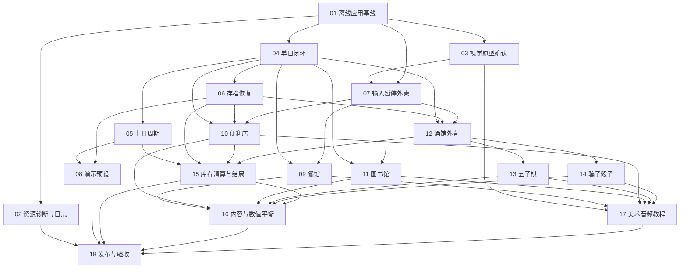

# 《像素小镇：十日经营计划》项目计划

## 目标

以五个阶段交付一个可离线构建、可测试、可从新游戏运行至第十天主结局的 Windows 像素风模拟经营作品。每个阶段具有明确完成门槛，不以代码量或素材数量代替端到端可运行证据。

## 执行原则

- issue 采用 tracer-bullet 垂直切片；每个切片完成后必须可演示或可独立验证。
- 阶段编号表示产品成熟度，不表示代码目录或团队成员。
- “Blocked by”只记录真实依赖；同一阶段无依赖的 issue 可以并行。
- issue 是否可启动由其 `Blocked by` 决定；阶段门槛用于判断整个阶段能否宣布完成，不额外制造虚假串行依赖。
- AFK issue 可独立执行；HITL issue 必须经过人工视觉确认、试玩或发布验收。
- `main` 始终保持可构建。后续阶段不得破坏已通过的阶段门槛。
- 具体日历日期尚未确定，当前按门槛推进；演示前七天冻结功能。

## 阶段总览

| 阶段 | 目标 | 最早启动条件 | 完成门槛 |
| --- | --- | --- | --- |
| P0 | 工程基线 | 产品契约、技术栈和 ADR 已确认 | 离线构建、测试、CI、资源错误页和视觉规格成立 |
| P1 | 核心闭环 | 对应 P0 blocker 完成 | 模拟地点结果可跑通十日周期、存档恢复、演示预设和占位结局 |
| P2 | 白天玩法 | 单日闭环及对应交互/存档 blocker 完成 | 餐馆、便利店、图书馆均通过真实 UI 返回统一行动结果 |
| P3 | 夜晚与结局 | 单日闭环、存档和交互外壳完成 | 酒馆双玩法、最终库存清算和七种主结局进入完整循环 |
| P4 | 交付打磨 | 对应完整玩法 blocker 完成 | 内容、平衡、像素表现、音频、署名、发布包和演示验收完成 |

## 依赖图

## P0：工程基线

目标是证明团队能够从干净检出离线构建同一项目、运行同一测试入口，并在缺少资源时得到可诊断反馈。

| Issue | 类型 | 依赖 | 独立证据 |
| --- | --- | --- | --- |
| [01 建立可离线复现的应用基线](../.scratch/pixel-town-ten-day-plan/issues/01-p0-offline-app-baseline.md) | AFK | 无 | Windows/macOS 构建、raylib 窗口、CTest 和 CI |
| [02 提供启动资源诊断与本地日志](../.scratch/pixel-town-ten-day-plan/issues/02-p0-resource-diagnostics-and-log.md) | AFK | 01 | 正常启动与缺失资源错误路径 |
| [03 确认像素视觉原型与资源规范](../.scratch/pixel-town-ten-day-plan/issues/03-p0-visual-prototype-approval.md) | HITL | 01 | 人工批准的画布、字体、调色板和素材规范 |

P0 门槛：五名成员可在约定工具链上完成离线配置与构建；CI 可运行；视觉规格不再阻塞基础 UI。

## P1：核心闭环

目标是优先完成一个没有真实地点内容但已经具备时间、状态、存档和结局的可玩骨架。

| Issue | 类型 | 依赖 | 独立证据 |
| --- | --- | --- | --- |
| [04 跑通一个完整游戏日](../.scratch/pixel-town-ten-day-plan/issues/04-p1-one-day-vertical-loop.md) | AFK | 01 | 新游戏到首日结算 |
| [05 扩展为十日周期与占位主结局](../.scratch/pixel-town-ten-day-plan/issues/05-p1-ten-day-cycle.md) | AFK | 04 | 十日无图形集成测试与可见结局 |
| [06 实现阶段边界自动存档与恢复](../.scratch/pixel-town-ten-day-plan/issues/06-p1-save-and-resume.md) | AFK | 04 | 各阶段保存、恢复和损坏处理 |
| [07 完成窗口、输入、暂停与静音外壳](../.scratch/pixel-town-ten-day-plan/issues/07-p1-interaction-shell.md) | AFK | 01、03 | 像素缩放、输入、暂停和静音 |
| [08 实现隔离的演示预设加载](../.scratch/pixel-town-ten-day-plan/issues/08-p1-demo-presets.md) | AFK | 05、06 | 参数加载预设且正式存档不变 |

P1 门槛：从标题开始可连续完成十天；阶段不可重复；退出后可恢复；演示预设与玩家存档隔离。

## P2：白天玩法

三个地点 issue 在各自明确的 P1 blocker 完成后并行，均通过统一地点契约返回行动结果；P1 尚未达到整体门槛时不能宣告 P1 完成。

| Issue | 类型 | 依赖 | 独立证据 |
| --- | --- | --- | --- |
| [09 接入完整餐馆白天工作](../.scratch/pixel-town-ten-day-plan/issues/09-p2-restaurant-work.md) | AFK | 04、07 | 订单、计时、错单和结算闭环 |
| [10 接入跨日库存的便利店经营](../.scratch/pixel-town-ten-day-plan/issues/10-p2-convenience-store.md) | AFK | 04、06、07 | 进货、价格档位、需求、库存和存档 |
| [11 接入数据驱动的图书馆工作](../.scratch/pixel-town-ten-day-plan/issues/11-p2-library-work.md) | AFK | 04、07 | 数据题库、分类匹配和奖励闭环 |

P2 门槛：三个地点都能从地图进入、完成、返回，并由核心系统准确应用行动结果。

## P3：夜晚与结局

酒馆外壳在单日闭环、存档和交互外壳完成后即可与 P2 三个白天地点并行。五子棋、骗子骰子和正式结局在酒馆战绩契约稳定后可以并行；阶段完成门槛仍要求三者全部完成，且最终结局依赖便利店库存。

| Issue | 类型 | 依赖 | 独立证据 |
| --- | --- | --- | --- |
| [12 接入酒馆选择、赌注与夜晚结算](../.scratch/pixel-town-ten-day-plan/issues/12-p3-tavern-shell.md) | AFK | 04、06、07 | 每晚一次挑战选择与统一结算 |
| [13 接入自由五子棋和电脑对手](../.scratch/pixel-town-ten-day-plan/issues/13-p3-gomoku.md) | AFK | 12 | 完整棋局、规则测试和启发式 AI |
| [14 接入 1v1 骗子骰子](../.scratch/pixel-town-ten-day-plan/issues/14-p3-liars-dice.md) | AFK | 12 | 完整淘汰赛、质疑和万能点规则 |
| [15 完成库存清算与七种主结局](../.scratch/pixel-town-ten-day-plan/issues/15-p3-endings.md) | AFK | 05、06、10、12 | 第十日完整结算与唯一主结局 |

P3 门槛：玩家可选择回家或一种酒馆挑战；第十天后完成库存清算并生成可解释的唯一主结局。

## P4：交付打磨

| Issue | 类型 | 依赖 | 独立证据 |
| --- | --- | --- | --- |
| [16 完成内容扩充与数值平衡](../.scratch/pixel-town-ten-day-plan/issues/16-p4-content-and-balance.md) | HITL | 09-15 | 固定种子模拟、人工试玩记录和批准参数 |
| [17 完成像素美术、音频、教程与署名](../.scratch/pixel-town-ten-day-plan/issues/17-p4-presentation-and-credits.md) | HITL | 03、09-11、13、14 | 最终资源、许可、教程和人工视觉验收 |
| [18 完成发布包、演示和最终验收](../.scratch/pixel-town-ten-day-plan/issues/18-p4-release-acceptance.md) | HITL | 02、08、15-17 | Windows 发布包、全测试、演示脚本和实机验收 |

P4 门槛：完整自动化测试通过；目标 Windows 机器离线运行；演示预设、PPT、许可证和现场流程全部验收。

## 五人协作建议

- 核心与集成负责人优先处理 01、04-08、15、18，并维护共享契约。
- 餐馆负责人主责 09；便利店负责人主责 10；图书馆负责人主责 11。
- 酒馆与展示负责人主责 03、12-14、17，并与核心负责人共同完成 07、18；Issue 12 可在 P2 白天地点开发期间启动。
- P0/P1 阶段其他成员不等待：参与测试、资源原型、CI 验证和契约评审。
- issue 负责人不等同于唯一开发者；所有合并仍需至少一人交叉审查。

## 变更控制

- P0-P3 发现新功能需求时，默认进入 P4 之后，不插入当前阶段。
- 需要改变领域不变量、地点契约或存档语义时，先更新 PRD/设计并评估 ADR。
- 临时数值只用于跑通切片；不得因为“感觉不错”跳过 P4 的模拟和试玩批准。
- 若阶段门槛失败，回到产生失败的最早 issue 修复，不在后续 issue 中叠加补丁。
